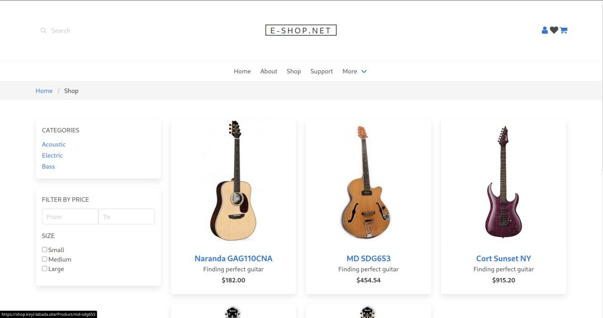
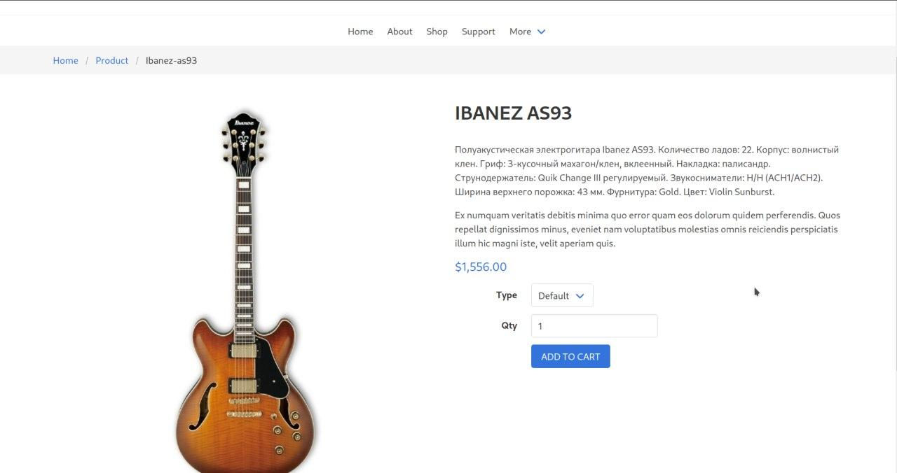
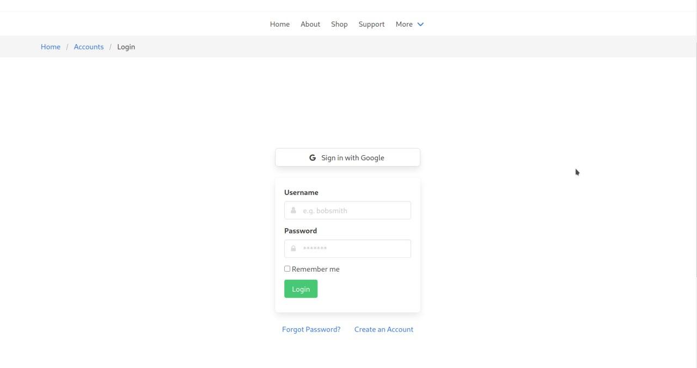
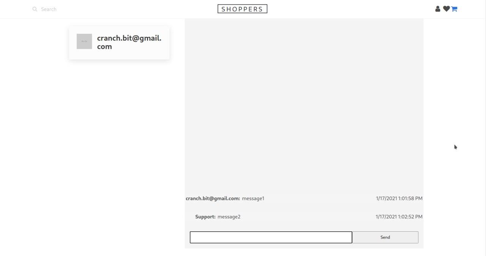
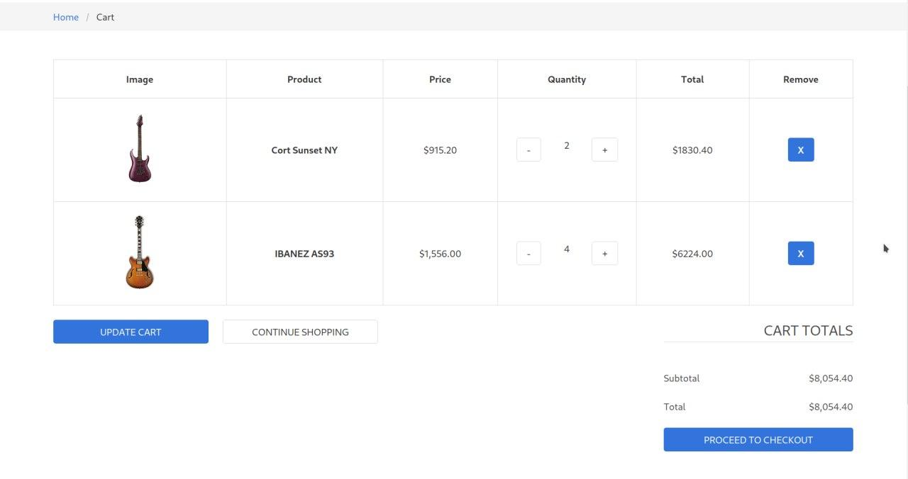
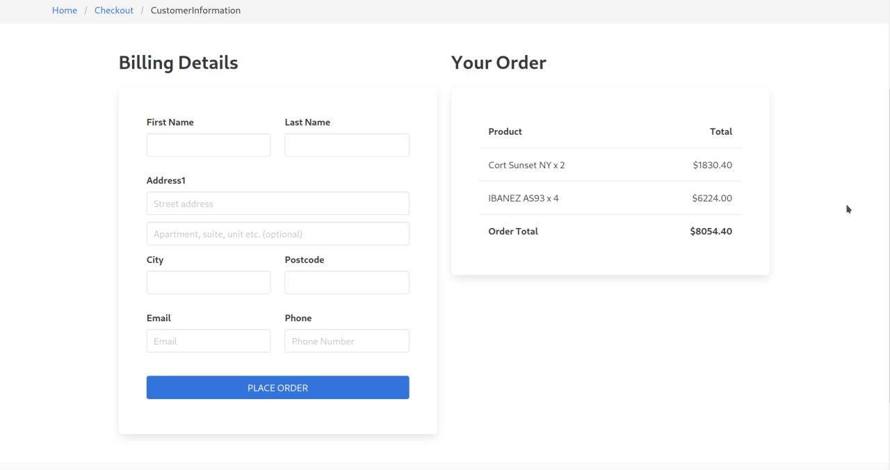
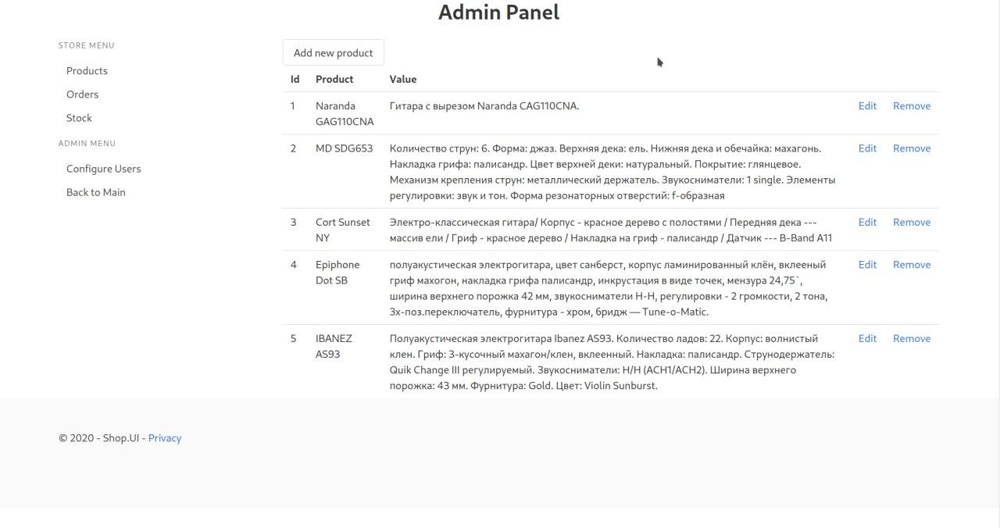

E-commerce with **AspNetCore 3.1**
==================================

[Link to preview shop.kiryl-labada.site](https://shop.kiryl-labada.site/)

Catalog
-------
- **Category filters**
- **Pagination**

Product detail
--------------
- **Type (color, model, etc)**

Login
-----
- **Google auth**
- **Reset password**

Support chat
------------
- **SignalR (real time messaging)**

Cart, Payment
-------------
- **Stripe payment**

Admin panel
-----------
- **Create new products**
- **Process orders**
- **Update products**

Android mobile client
---------------------
[Github repository](https://github.com/kiryl-labada/e-shop-android)